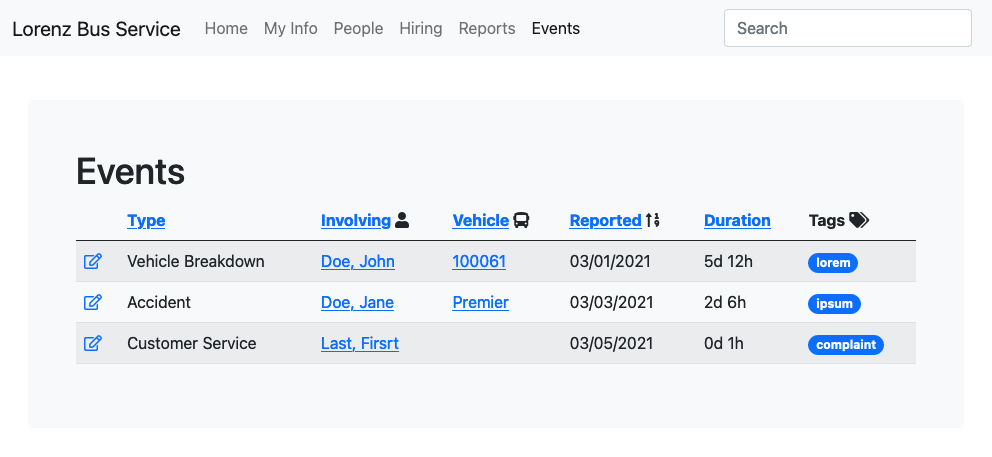
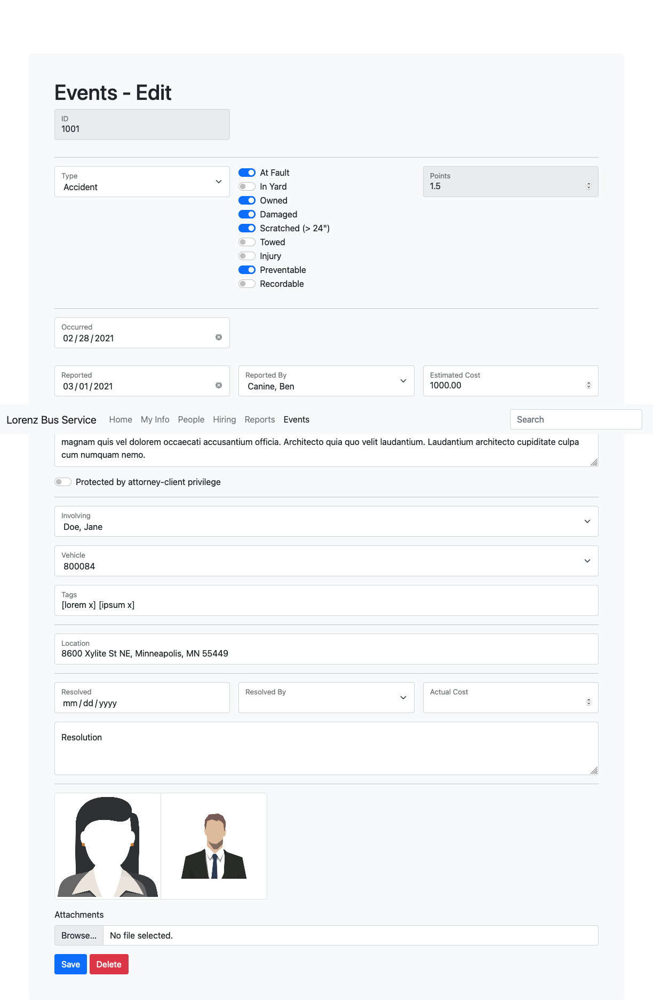

# Events

## UI

## Index

### Rules

- List of all events where `Resolved IS NULL`
- `Duration` is `Today - Reported`, formatted in days and hours

### Features

- Accessible via `Events` menu
- Allow sorting by column header
- Allow events to be filtered by `Employee`, `Reported`, `Vehicle`, `Status`

## Edit/Create

### Features

- Toggling any switch (`AtFault`,`InYard`,`Owned`,`Damaged`,`Scratched`,`Towed`,`Injury`,`Preventable`,`Recordable`) recalculates `Points`

### Point System

AtFault|InYard|Owned|Damaged|Scratched|Towed|Injury|Preventable|Recordable|Points
---|---|---|---|---|---|---|---|---|---
||||||||||0
|||||||||X|1.5
||||||||X||0.5
|||||||X|||1.0
||||||X||||0.5
||||X||||||0.34

## Model

### `Event`
Abstracted model for persisting events
name|data type|comments
---|---|---
Id|`int`|primary key
Type|`EventType`|`Accident`, `Customer Service`, `Vehicle Breakdown`
AtFault|`bit`|
InYard|`bit`|
Owned|`bit`|
Damaged|`bit`|
Scratched|`bit`|
Towed|`bit`|
Injury|`bit`|
Preventable|`bit`|
Recordable|`bit`|
Occurred|`date`|
Reported|`date`| `>= Occcurred`
ReportedBy|`Employee`|`Employee` that reported the event
EstimatedCost|`decimal`|`>0` or `null`
Issue|`text`|
Priviledged|`bit`|
Employees|`Employee[]`|zero or more `Employee`s
Vehicles|`Vehicle[]`|zero or more `Vehicle`s
Tags|`Tag[]`|zero or more `Tags`
Location|`string`|free-entry
Latitude|`single`|geocoded [wgs84] `Location`
Longitude|`single`|geocoded [wgs84] `Location`
Resolved|`date`|`>= Reported`
ResolvedBy|`Employee`|`Employee` that resolved the incident
Resolution|`text`|
ActualCost|`decimal`|`>0` or `null`
Attachments|`Attachment[]`|zero or more `Attachment`s

### `EventType`

`Type`s assigned to `Event`; (pne-to-many)
name|data type|comments
---|---|---
Name|`string`|primary key

### `EventTag`
`Tag`s assigned to `Event`; (many-to-one)
name|data type|comments
---|---|---
EventId|`int`|primary key
TagId|`int`|primary key

### `Tag`
Flexible categorization; (one-to-many)
name|data type|comments
---|---|---
Id|`int`|primary key
Name|`string`|

### `EventEmployee`
`Employee`s involved in the `Event`; (many-to-many)
name|data type|comments
---|---|---
Id|`int`|primary key
IncidentId|`int`|foreign key
EmployeeId|`int`|foreign key; references BambooHr key

### `EventVehicle`
`Vehicle`s involved in the `Event`; (many-to-many)
name|data type|comments
---|---|---
Id|`int`|primary key
IncidentId|`int`|foreign key
VehicleId|`int`|foreign key

### `Vehicle`
List of `Vehicle`s
name|data type|comments
---|---|---
Id|`int`|primary key
Name|`string`|

## `EventAttachment`
Binary files (audio|video|pictures|documents) related to the `Event`; (one-to-many)
name|data type|comments
---|---|---
Id|`int`|primary key
EventId|`int`|foreign key
MimeType|`string`|`application/pdf`,`image/png`
Data|`byte[]`|byte-encoded data
Notes|`text`|

<!-- ## Event Link
Links related to the Event; (one-to-many)
name|data type|comments
---|---|---
Id|`int`|primary key
EventId|`int`|foreign key
Title|`int`|Page's title
Uri|`int`|Uri to resource
Notes|`text`| -->

## Questions

- workflow triggers based on data values?
- webhooks?
- events?
