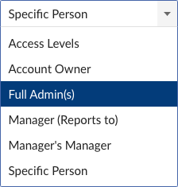
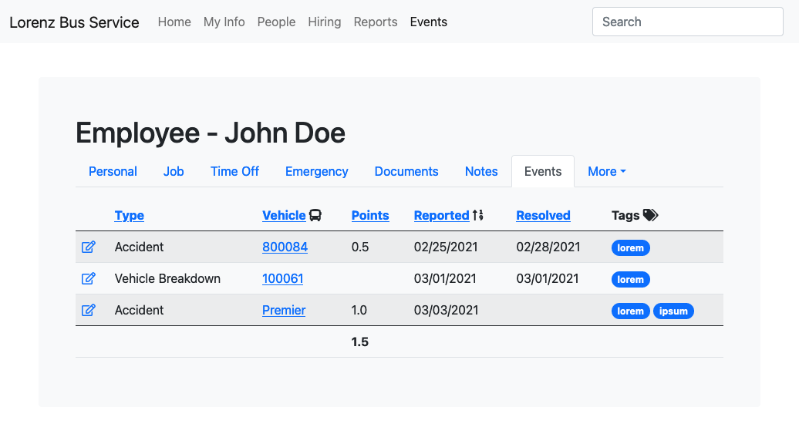

# Events

## UI

## Index

### Features

- Accessible via `Events` menu
- Allow `Type`, `Reported`, `Duration` to be sorted by clicking the column header; default sorting is `Reported` ascending
- Allow events to be filtered by `Type`, `Employees`, `Vehicles`, `Reported`, `Tags`

### Rules

- List of all events where `Resolved IS NULL`
- `Duration` is `Today - Reported`, formatted in days and hours

## Edit/Create

### Features

- Toggling any switch (`AtFault`,`InYard`,`Owned`,`Damaged`,`Scratched`,`Towed`,`Injury`,`Preventable`,`Recordable`) recalculates `Points`

### Rules
- `Delete` button is disabled for all users exept administrators
- if `Priviledged` is selected, the `Delete` button is disabled for **everyone**
- Event record is non-editable for all users except administrators once `Resolved`, `Resolved By`, and `Resolution` properties have been set and the record is saved
- `Type`, `Occurred`, and `Reported`, `Reported By`, and `Issue` are mandatory fields
- `Resolved`, `Resolved By`, and `Resolution` must be provided as a set
- Toggle fields (e.g. `Owned`,`Damaged`) are enabled if `Type` is `Accident`
- `Points` text value is calculated by selecting one or more toggle fields; `Points` is always disabled
- `ReportedBy` and `ResolvedBy` are employees in the [to be determined] group:

### Point System

AtFault|InYard|Owned|Damaged|Scratched|Towed|Injury|Preventable|Recordable|Points
---|---|---|---|---|---|---|---|---|---
||||||||||0
|||||||||X|1.5
||||||||X||0.5
|||||||X|||1.0
||||||X||||0.5
||||X||||||0.34

## Employee > Events > Index

- List of all events for a specific employee

### Features

- Accessible via `Employee` > `Events` tab
- Allow `Type`, `Points`, `Reported`, `Resolved` to be sorted by clicking the column header; default sorting is `Reported` ascending
- Allow events to be filtered by `Type`, `Vehicles`, `Points`, `Reported`, `Resolved`, `Tags`
- Sum of all `Point`s for the employee located in the table's footer

## Model (logical)

### `Event`
Abstracted model for persisting events
name|data type|comments
---|---|---
Id|`int`|unique identifier
Type|`EventType`|`Accident`, `Customer Service`, `Vehicle Breakdown`
AtFault|`bool`|
InYard|`bool`|
Owned|`bool`|
Damaged|`bool`|
Scratched|`bool`|
Towed|`bool`|
Injury|`bool`|
Preventable|`bool`|
Recordable|`bool`|
Points|`float`|applies to all employees associated w/ the event
Occurred|`date`|
Reported|`date`| `>= Occcurred`
ReportedBy|`Employee`|`Employee` that reported the event
EstimatedCost|`float`|`>0` or `null`
Issue|`string`|
Priviledged|`bool`|
Employees|`Employee[]`|zero or more `Employee`s
Vehicles|`Vehicle[]`|zero or more `Vehicle`s
Tags|`Tag[]`|zero or more `Tags`
Location|`string`|free-entry
Latitude|`float`|geocoded [wgs84] `Location`
Longitude|`float`|geocoded [wgs84] `Location`
Resolved|`date`|`>= Reported`
ResolvedBy|`Employee`|`Employee` that resolved the incident
Resolution|`string`|
ActualCost|`float`|`>0` or `null`
Attachments|`Attachment[]`|zero or more `Attachment`s

### `Attachment`
Binary files (audio|video|pictures|documents) related to the `Event`
name|data type|comments
---|---|---
Name|`string`|
Data|`byte[]`|
MimeType|`string`|example: `application/pdf`

### `Employee`
The BambooHr employee model

### `EventType`
name|data type|comments
---|---|---
Name|`string`|

### `Tag`
Flexible categorization
name|data type|comments
---|---|---
Name|`string`|

### `Vehicle`
Bus, truck, etc.
name|data type|comments
---|---|---
Name|`string`|
Active|`bool`|

## Model (physical; relational)

### `Event`
- `Event >-- Employee` (Reported)
- `Event >-- Employee` (Resolved)
- `Event --< EventAttachment`
- `Event --< EventEmployee`
- `Event --< EventTag`
- `Event >-- EventType`
- `Event --< EventVehicle`

name|data type|comments
---|---|---
Id|`int`|primary key
EventTypeId|`int`|foreign key
ReportedById|`int`|foreign key
ResolvedById|`int`|foreign key

### `EventType`
- `EventType --< Event`

name|data type|comments
---|---|---
Id|`int`|primary key
Name|`string`|primary key

### `EventTag`
- `EventTag >-- Event`
- `EventTag >-- Tag`

name|data type|comments
---|---|---
EventId|`int`|primary key
TagId|`int`|primary key

### `Tag`
- `Tag --< EventTag`

name|data type|comments
---|---|---
Id|`int`|primary key
Name|`string`|

### `EventAttachment`
- `EventAttachment >-- Event`

name|data type|comments
---|---|---
Id|`int`|primary key
EventId|`int`|foreign key
Name|`string`|
MimeType|`string`|`application/pdf`,`image/png`
Data|`byte[]`|byte-encoded data

### `EventEmployee`
- `EventEmployee >-- Event`
- `EventEmployee >-- Employee`

name|data type|comments
---|---|---
IncidentId|`int`|primary key
EmployeeId|`int`|primary key; (BambooHr key)

### `Employee`
- `Employee --< EventEmployee`
- `Employee --< Event` (Reported)
- `Employee --< Event` (Resolved)

name|data type|comments
---|---|---
Id|`int`|primary key

### `EventVehicle`
- `EventVehicle >-- Event`
- `EventVehicle >-- Vehicle`

name|data type|comments
---|---|---
EventId|`int`|primary key
VehicleId|`int`|primary key

### `Vehicle`
- `Vehicle --< EventVehicle`

name|data type|comments
---|---|---
Id|`int`|primary key
Name|`string`|

## Questions

- workflow triggers based on data values?
- webhooks?
- events?
